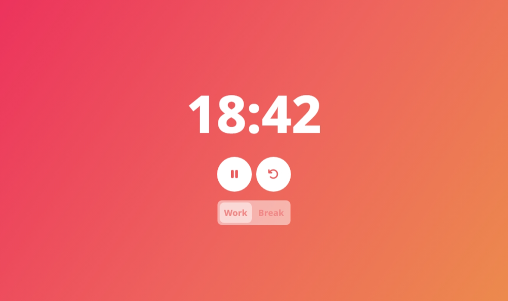

# timeato

A basic Pomodoro timer for managing your time.

*(Is it pronounced "tie-may-to", "tie-mah-to", "tih-may-to", or "tih-mah-to"? I made up the word and even I don't know how to pronounce it)*

# Changelog

## v0.0.1

- first version YAAAAY
- basic pomodoro timer features (work-break cycle, no long break yet)
- start/pause/restart buttons
- switch between work and break timers
